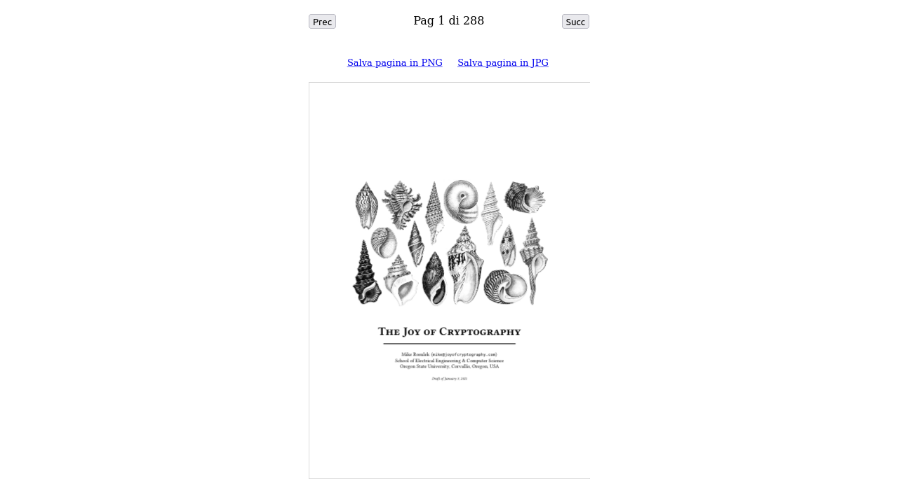

# mmPDF

---

Semplice applicazione web funzionante off-line per salvare come immagini PNG o JPEG le pagine di un PDF.

Open source, senza banner, rispetta la privacy, non richiede connessione a Internet, funziona direttamente nel browser senza installazione.

## Istruzioni

1. Scaricare il file [build/mmPDF.html](build/mmPDF.html)
2. Fare doppio clic sul file scaricato (dovrebbe aprirsi nel browser)
3. Selezionare il file PDF, andare alla pagina desiderata ed esportarla in PNG o JPG

## Informazioni tecniche e Licenze

Utilizza PDF.js (Mozilla License) e jQuery (MIT License). L'icona Sponge proviene da flaticon.com (Flaticon License).

Vengono forniti i codici sorgente di tutti i componenti, le patch e lo script per assemblare la pagina - sentitivi liberi di migliorare il codice e inviare PR.
Il file ``make.sh`` può essere usato per verificare la riproducibilità del file finale pubblicato in ``/build``.

---

Simple offline one-page-app for saving PDF pages as PNG or JPEG images.

Open source, no banners, respects your privacy, does not require Internet connection, works directly in the browser without installation.

## Instructions

1. Download [build/mmPDF.html](build/mmPDF.html)
2. Double click the downloaded file (it should open inside a browser tab)
3. Select a PDF, go to the desired pag and export it as PNG or JPG

## Technical info and Licenses

Uses PDF.js (Mozilla License) and jQuery (MIT License). Sponge icon by flaticon.com (Flaticon License).

Source modules, patches and the build script are provided - feel free to improve and submit a PR.
The ``make.sh`` file can be used to verify the reproducibility of the assembled output file published inside ``/build``.
